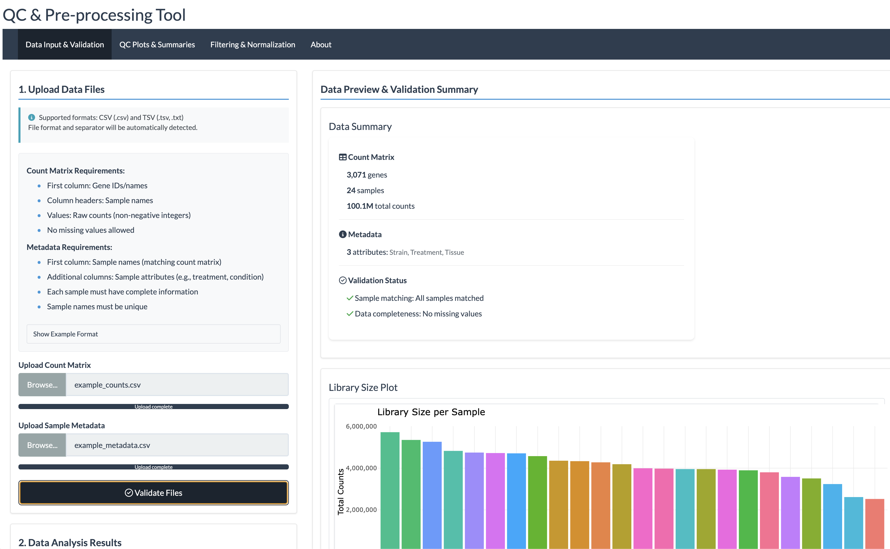
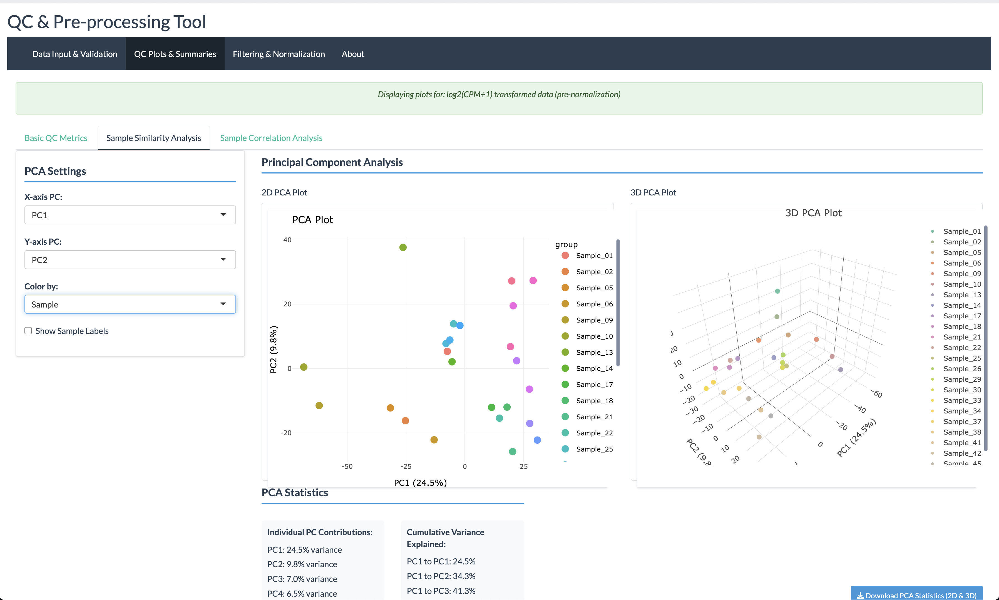
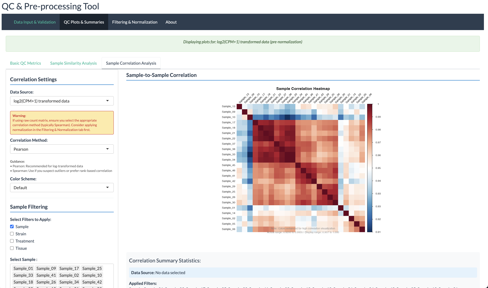
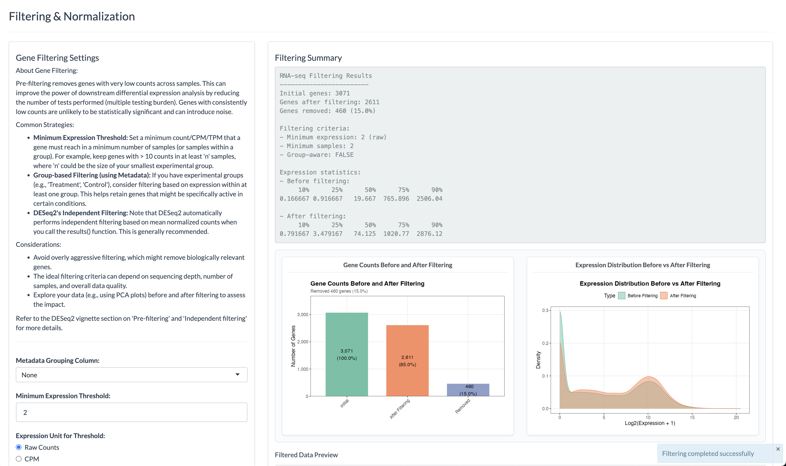
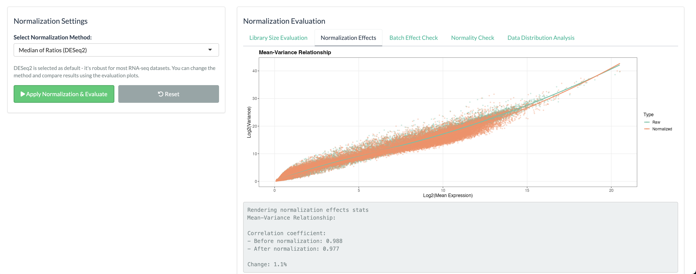
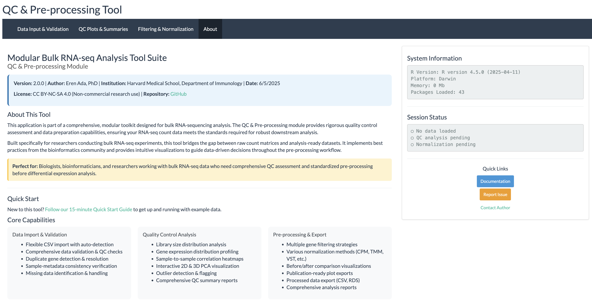

# Modular Bulk RNA-seq Analysis RShiny Tool Suite

[](https://github.com/hms-immunology/RNA_Processing_APP/actions)
[](https://creativecommons.org/licenses/by-nc-sa/4.0/)
[](https://www.r-project.org/)

**Author:** Eren Ada, PhD  
**Date:** 6/3/2025  
**Current Version:** 2.0.0

## Project Overview

This project develops a comprehensive and modular bulk RNA-sequencing (RNA-seq) analysis tool using RShiny. The suite consists of interconnected RShiny applications, each dedicated to a specific stage of the RNA-seq analysis workflow.

### Current Status: QC & Pre-processing Tool (Complete)

The first module is fully operational and provides comprehensive quality control and pre-processing capabilities for bulk RNA-seq count data.

> **See the [Screenshots & Interface Overview](#screenshots--interface-overview) section below for a visual tour of the application's features and workflow.**

## Module 1: QC & Pre-processing Tool (Complete)

**Status:** Complete and Production-Ready  
**Location:** `app.R` (main application)

### Features
- **Data Input & Validation**: Flexible CSV upload with comprehensive validation
- **Quality Control**: Library size analysis, expression distributions, sample correlations, PCA
- **Filtering & Normalization**: Multiple strategies for gene filtering and data normalization
- **Export Capabilities**: Processed data and publication-ready visualizations

### Quick Start
```r
# Launch the application
shiny::runApp("app.R")
```

For detailed usage instructions, see the [Quick Start Guide](docs/user_manual/quick_start.md).

### Key Features at a Glance
| Feature | Screenshot | Description |
|---------|------------|-------------|
| **Data Import** | [Validation](#1-data-input--validation) | Smart CSV/TSV import with comprehensive validation |
| **Quality Control** | [PCA Analysis](#2-quality-control-analysis) | Interactive 2D/3D PCA with sample grouping |
| **Correlation Analysis** | [Sample Correlation](#3-sample-correlation-analysis) | Comprehensive correlation heatmaps |
| **Gene Filtering** | [Filtering](#4-gene-filtering--processing) | Advanced filtering with real-time impact visualization |
| **Normalization** | [Normalization](#5-normalization--evaluation) | Multiple methods with evaluation metrics |
| **Documentation** | [About Section](#6-about--documentation) | Tool information and comprehensive resource access |

## Planned Modules

2. **Differential Gene Expression (DEG) Analysis Tool** (In Development)
3. **Pathway & Functional Enrichment Analysis Tool** (Planned)
4. **Advanced Visualization Tool** (Planned)

## Documentation

### For Users
- **[Complete User Manual](docs/user_manual/README.md)** - Comprehensive guide to all features
- **[Quick Start Guide](docs/user_manual/quick_start.md)** - 15-minute walkthrough
- **[Technical Requirements](docs/user_manual/technical_requirements.md)** - System requirements and setup
- **[Troubleshooting Guide](docs/user_manual/troubleshooting.md)** - Common issues and solutions

### For Developers
- **[Developer Documentation](docs/developer/README.md)** - Architecture and development guidelines
- **[Testing Framework](docs/developer/README.md#testing-framework)** - Testing guidelines and examples
- **[Project Status](docs/project_status.md)** - Current development status

## System Requirements

- **R Version**: 4.0.0 or higher (4.3.0+ recommended)
- **Operating System**: Windows 10+, macOS 10.14+, or Linux (Ubuntu 18.04+)
- **RAM**: 4GB minimum (8GB recommended)
- **Browser**: Chrome, Firefox, Safari, or Edge (latest versions)

## Installation & Setup

### Automatic Setup (Recommended)
The application automatically installs required packages on first launch:

```r
# Navigate to the APP directory
setwd("path/to/APP")

# Launch application (packages install automatically)
shiny::runApp("app.R")
```

### Manual Setup
For development or troubleshooting:

```r
# Install package manager
if (!require("BiocManager", quietly = TRUE))
    install.packages("BiocManager")

# Install core dependencies
BiocManager::install(c("DESeq2", "edgeR", "limma"))
install.packages(c("shiny", "DT", "plotly", "ggplot2"))
```

## Screenshots & Interface Overview

Explore the application's intuitive interface and comprehensive analysis capabilities through these screenshots:

### 1. Data Input & Validation
**Smart data import with comprehensive validation**
- Automatic format detection (CSV/TSV)
- Real-time validation feedback with detailed requirements
- Sample-metadata consistency checking
- Missing data identification and handling


*The validation interface shows data summary, validation status, and library size distribution for quality assessment.*

---

### 2. Quality Control Analysis
**Interactive PCA visualization for sample relationship assessment**
- 2D and 3D PCA plots with customizable components
- Sample grouping by experimental factors
- Outlier detection and identification
- Variance contribution statistics


*PCA plots reveal sample clustering patterns and help identify potential batch effects or outliers.*

---

### 3. Sample Correlation Analysis
**Comprehensive correlation heatmaps for sample quality assessment**
- Sample-to-sample correlation matrices
- Customizable correlation methods (Pearson, Spearman)
- Interactive filtering by experimental groups
- Visual correlation strength indicators


*Correlation heatmaps help identify sample relationships and potential technical issues.*

---

### 4. Gene Filtering & Processing
**Advanced filtering with real-time impact visualization**
- Multiple filtering strategies (count-based, CPM-based, group-aware)
- Before/after comparison statistics
- Interactive threshold adjustment
- Gene retention summaries and distribution plots


*The filtering interface provides comprehensive options with immediate visual feedback on data impact.*

---

### 5. Normalization & Evaluation
**Robust normalization with comprehensive evaluation metrics**
- Multiple normalization methods (CPM, TMM, VST, RLE, etc.)
- Mean-variance relationship assessment
- Library size evaluation across methods
- Normalization effectiveness statistics


*Normalization evaluation helps choose the most appropriate method for your data characteristics.*

---

### 6. About & Documentation
**Comprehensive tool information and resource access**
- Detailed tool description and institutional context
- System information and session status monitoring
- Quick access to documentation and support resources
- Professional presentation with licensing information


*The About section provides comprehensive tool information, system status, and easy access to documentation.*

## Example Usage

### Basic Workflow
1. **Data Upload**: Load count matrix and metadata (CSV format)
2. **Validation**: Review data validation results and handle any issues
3. **Quality Control**: Examine QC plots and assess data quality
4. **Processing**: Apply filtering and normalization based on QC results
5. **Export**: Download processed data and reports

### Example Data
Sample datasets are provided in the `example_data/` directory for testing and learning:

- **`example_counts.csv`** - Anonymized count matrix (5,001 genes × 24 samples)
- **`example_metadata.csv`** - Corresponding sample metadata with experimental design
- Additional larger datasets available for comprehensive testing

The example data represents a multi-factorial experimental design with:
- **2 Strains** (StrainA, StrainB) 
- **2 Treatments** (Control, TreatmentX)
- **3 Tissue types** (Tissue1, Tissue2, Tissue3)
- **2 biological replicates** per condition

## Features & Capabilities

### Data Handling
- Flexible CSV import with configurable delimiters
- Automatic duplicate gene detection and handling
- Sample consistency validation between count matrix and metadata
- Support for various gene ID formats (Ensembl, Gene Symbol, etc.)

### Quality Control
- Library size distribution analysis
- Gene expression distribution plots
- Sample-to-sample correlation heatmaps
- Interactive 2D and 3D PCA plots
- Comprehensive QC summary reports

### Filtering & Normalization
- **Filtering Options**: Count-based, CPM-based, group-aware filtering
- **Normalization Methods**: CPM, TMM, RLE, VST, RLOG
- Real-time impact visualization
- Before/after comparison plots

### Export & Integration
- Multiple export formats (CSV, RDS, PDF)
- Publication-ready plots
- Comprehensive analysis reports
- Compatible with downstream DEG analysis tools

## Development Roadmap

For a detailed development plan, see the [Framework Roadmap](framework_roadmap.md).

### Completed
- Module 1: QC & Pre-processing Tool (v2.0.0)
- Comprehensive documentation system
- Testing framework foundation

### In Progress
- Module 2: Differential Expression Analysis Tool
- Enhanced visualization options
- Performance optimizations

### Planned
- Module 3: Pathway & Functional Enrichment Analysis
- Module 4: Advanced Visualization Tool
- Integration between modules
- Batch processing capabilities

## Contributing

We welcome contributions! Please see our [Developer Documentation](docs/developer/README.md) for:
- Development setup and guidelines
- Code style and standards
- Testing requirements
- Pull request process

### Quick Contribution Steps
1. Fork the repository
2. Create a feature branch
3. Follow coding standards in [Developer Guide](docs/developer/README.md)
4. Add tests for new functionality
5. Update documentation
6. Submit pull request

## Support & Community

### Getting Help
1. Check the [Troubleshooting Guide](docs/user_manual/troubleshooting.md)
2. Review [Technical Requirements](docs/user_manual/technical_requirements.md)
3. Try with example data to isolate issues
4. Create an issue with detailed information

### Reporting Issues
When reporting bugs or requesting features:
- Use the issue templates
- Include system information (R version, OS, browser)
- Provide reproducible examples
- Specify dataset characteristics if relevant

## License

This project is licensed under the Creative Commons Attribution-NonCommercial-ShareAlike 4.0 International License - see the [LICENSE](LICENSE) file for details.

## Citation

If you use this tool in your research, please cite:

```bibtex
@software{ada2025rna,
  author = {Ada, Eren},
  title = {Modular Bulk RNA-seq Analysis RShiny Tool Suite},
  year = {2025},
  version = {2.0.0},
  url = {https://github.com/hms-immunology/RNA_Processing_APP}
}
```

## Acknowledgments

This project builds upon the excellent work of the Bioconductor community, particularly the DESeq2, edgeR, and limma packages for RNA-seq analysis.

---

**Current Focus**: The QC & Pre-processing Tool (Module 1) is complete and ready for production use. Development is now focused on Module 2 (Differential Expression Analysis) while maintaining and improving Module 1 based on user feedback. 